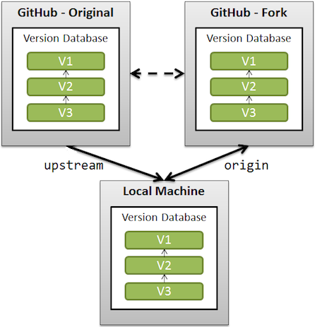

# spring2024
This is the project repository for COMSE6998 in the Spring 2024 term, *Computer Architecture Modeling, Simulation, and Evaluation*.

Instructor: Jose Moreira, Columbia University

## Guideline for students

Create your own fork by using the **Fork** button. 
In the **Create a new fork** page, choose yourself as the owner (`<owner>`) and a repository name (`<project>`).
You also want to check the box that says **Copy the main branch only** and click on the **Create fork** button.
This will create your own private repo that you can edit at your heart's content. 
You will still need to checkout the repo into a working clone in your machine(s), and then commit changes from the working clone back to your private fork.
You can create the working clone with:

>  git clone git@github.com:`<owner>`/`<project>`.git

You also need to set the original repository as the *upstream* repo:

>    cd `<project>`
> 
>    git remote add upstream https://github.com/comse6998/spring2024.git

Once you have done this, the class repo is the *upstream* repo for your working clone, and your own fork is the *origin* repo, as illustrated in this figure:

Before starting any work of your own, you need to update your working clone with the changes that may have happened in the upstream repo.
You can do that with:

>  git fetch upstream
> 
>  git merge upstream/main main

After you have resolved all merge conflicts, you should commit and then push to your forked repo.
Now both your working clone and your forked repo are updated from the upstream repo.
When you are ready to move your contribution to the main repository, click the **Contribute** button on your forked repo and ask for a *pull request*.

Keep situational awareness! 
You should never make changes to the main repository.
(If the configurations are right, you should not be able to.)
But your private repo is yours!
You can do anything you want, including deleting it and making a fresh fork.
